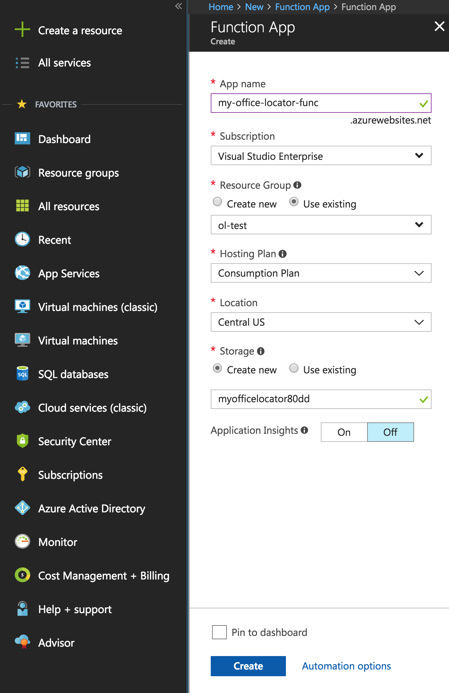
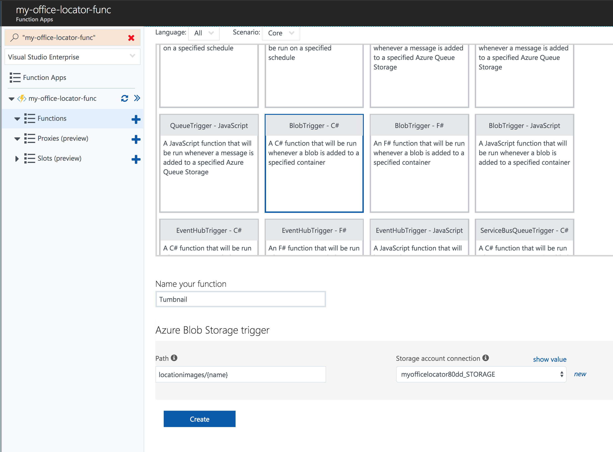
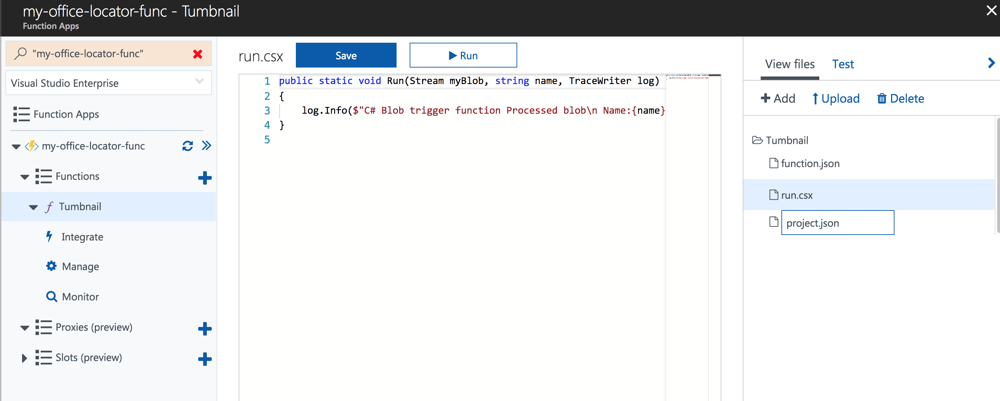
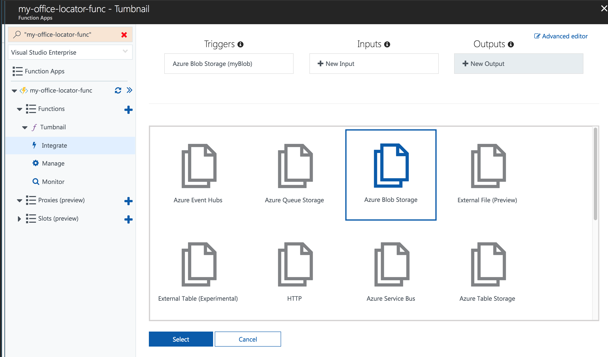
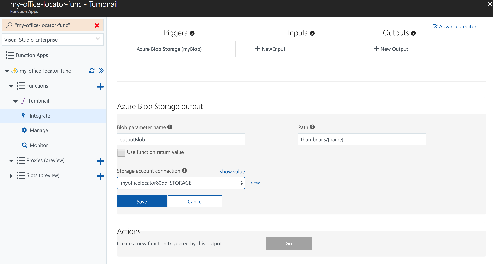
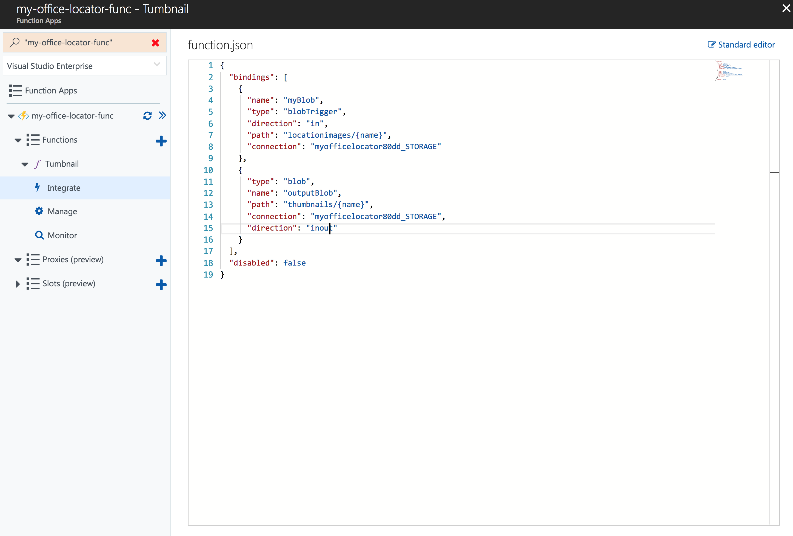
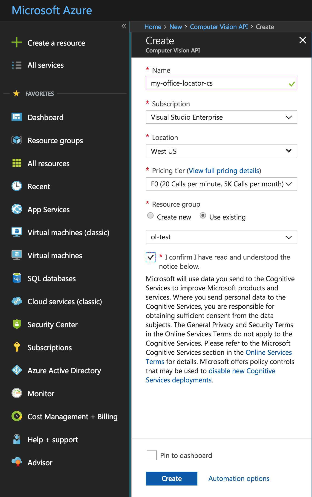
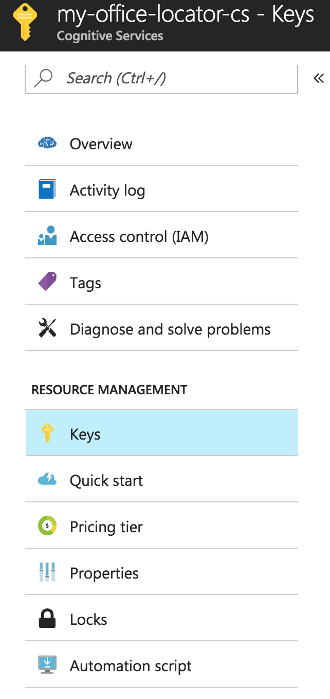
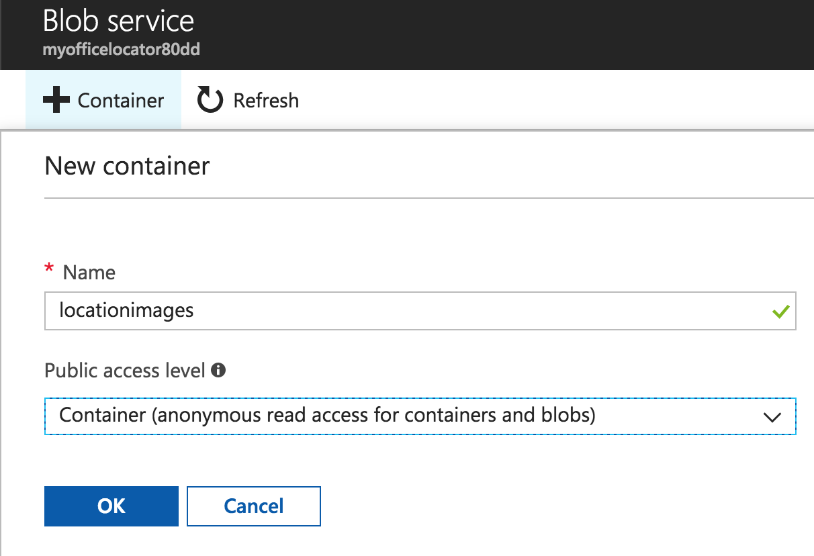

# Thumbnail Hack

In this hack, we're going to upload images to Azure Blob Storage and trigger an Azure Function to create thumbnails using Microsoft Cognitive Services.  The URI for new thumbnails will be stored in the Easy Table you created in the Easy Table Hack. After completing this hack, you will be able to host your images in the cloud and have them automatically resized for use in the Office Locator App.

### Step 0: Prerequisite

Complete the [Easy Table Hack](https://dwhathaway.github.io/app-office-locator/hacks/easy-table-hack.html)


### Step 1: Create a new Azure Function App

- Browse to [https://portal.azure.com](https://portal.azure.com)
- New > Function App
- Give the app a name (this must be unique - don't worry, the portal will tell you if it's not)
- Select your Azure Subscription 
- Choose "Use Existing" for the resource group, and use the same resource group you used for your Mobile App Service in the Easy Table Hack.  
- Choose "Consumption Plan" for the hosting plan.  This way you will only be charge for the resources your function actually uses.
- Select your location.
- Choose "Create New" for the Storage account.
- Click "Create"



### Step 2: Create your Function


- Once again, browse to [https://portal.azure.com](https://portal.azure.com)
- Click "App Services" from the menu on the left of the page, then select the Function App you just created.
- Click on "Functions"
- Click the `+ New Function` at the top
- Scroll down and click BlobTrigger - C#
- Name your Function "Thumbnail"
- Enter `locationimages/{name}` for the Path
- Click "New" next to "Storage account connection" and select the storage account you created in Step 1
- Click "Create"



### Step 3: Add a NuGet Package

- Click on "View Files" on the right side of the code editor
- Click "Add" to add a new File
- Name the file `project.json`



- Copy and paste this code into the project.json file and click "Save"


```
{
  "frameworks": {
    "net46":{
      "dependencies": {
        "Microsoft.Azure.Mobile.Client": "4.0.2"
      }
    }
  }
} 
```

### Step 4: Set your Fucntion Output

- Click "Integrate" on the left
- Click `+ New Output`
- Select "Azure Blob Storage"
- Click "Select"

 

- Enter `thumbnails/{name}` for the "Path"
- Select your Storage account under "Storage account connection"
- Click "Save"



> __Note:__ For the current version of Azure Functions we need to edit the function.json file the is automatically generated to work around a known issue.

- Click "Advanced editor" in the upper right
- Under the "OutputBlob" change the "direction" from `out` to `inout` as shown



### Step 5: Write your Function Code

- Click on "Tumbnail" (your function name) to open the code editor
- Copy and paste this code into the `run.csx` file (the default file that opens)

```
#r "Microsoft.WindowsAzure.Storage"

using Microsoft.WindowsAzure.Storage.Blob;
using System;
using System.Text;
using System.Net.Http;
using System.Net.Http.Headers;
using Microsoft.WindowsAzure.MobileServices;

public static async Task Run(Stream myBlob, CloudBlockBlob outputBlob,  string name, TraceWriter log)
{
    log.Info($" Image Name:  {name}");
    int width = 320; 
    int height = 320;
    bool smartCropping = true;
    string _apiKey = "<insert your cognitive services api key>";
    string _apiUrlBase = "https://api.projectoxford.ai/vision/v1.0/generateThumbnail";

    using (var httpClient = new HttpClient())
    {
        httpClient.BaseAddress = new Uri(_apiUrlBase);
        httpClient.DefaultRequestHeaders.Add("Ocp-Apim-Subscription-Key", _apiKey);
        using (HttpContent content = new StreamContent(myBlob))
        {
            //get response
            content.Headers.ContentType = new MediaTypeWithQualityHeaderValue("application/octet-stream");
            var uri = $"{_apiUrlBase}?width={width}&height={height}&smartCropping={smartCropping.ToString()}";
            var response = httpClient.PostAsync(uri, content).Result;
            var responseBytes = response.Content.ReadAsByteArrayAsync().Result;

            //write to output thumb
            await outputBlob.UploadFromByteArrayAsync(responseBytes, 0, responseBytes.Length);
            
            //save URI to database
            MobileServiceClient client = new MobileServiceClient("<insert your app service url>");
            string nameNoExt= System.IO.Path.GetFileNameWithoutExtension(name);
            var results = await client.GetTable<Location>().Where(x => x.Name==nameNoExt).ToListAsync();
            
            Location loc = results.FirstOrDefault(); 
            log.Info($" Image URI:  {outputBlob.Uri.ToString()}");
            loc.Image = outputBlob.Uri.ToString();

            await client.GetTable<Location>().UpdateAsync(loc);
        }
    }
}

public class Location
{
    public string Id{get;set;}
    public string Image {get;set;}
    public string Name { get; set; }
}
```
- Save the file

### Step 6: Create your Cognitive Service

- Click "Create a resource" in the upper left
- Search for `Computer Vision API`
- Give it a name and select a location
- Choose F0 for the "Pricing tier" - this is the free tier
- Select the same "Resource group" you have been using
- Click "Create"



### Step 7: Replace the values in your function script

- Navigate to the Cognitive Service you just created
- Go to "Keys"
- Copy Key 1



- Navigate back to your Function App
- Click on Thumbnail (the name of your function)
- Replace `<insert your cognitive services api key>` on line 16 with your copied API key
- Save the file
- Navigate to the Mobile App Service you created in the Easy Table Hack
- Copy the URL as shown


- Return to your Function App
- Replace `<insert your app service url>` on line 35 with your copied URL

### Step 8: Test your Function

- Click on "Resource Groups" on the left
- Select your resource group
- Select the Storage Accout you created with your Function
- Click "Blobs"
- Click `+ Container`
- Enter `locationimages` for the name
- Change the "Public access level" to "Containter"
- Click "Ok"



- Click "locationimages" to open the container (folder) you just created
- Click "Upload"
- Upload an image with a name that matches the name of one of your locations (must match exactly)
- In just a few seconds a new folder named "thumbnails" will be created and contain your resized image.
- Try running the Office Locator app again and see if the new image appears.

# Congratulations!

You've complete this hack!  
